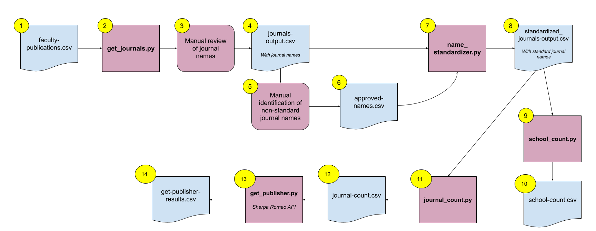

# Faculty Productivity

A suite of tools to analyze publications by faculty at the twenty-five colleges of the [City University of New York](http://www.cuny.edu/). Created by esilberberg, 2022.

# Overview
The original data set, compiled by the [Office of Research](https://www.cuny.edu/research/office-of-research/), includes citations of scholarly publications by CUNY faculty from 2015-2020. Given that the data set is unstructured, the project passes the data through a series of operations to improve standardization which in turn enables analysis. First, the project isolates the journal article name from the full citation. Next, these names are standardized to conform to the accepted journal name. From there, the project tallies the numbers of journals per college and the number of publications per journal. Lastly, the project determines the publisher of each journal, to give a sense of with which types of publishers faculty are choosing to publish.

# Functionality
All scripts are designed to be used as command line tools. To make scripts executable, run the following command:  
`chmod +x <script.py>`

**Help:** Throw up the -h flag (--help) to learn about a script's positional arguments

## get_journals.py 
Produces the journal name for citations in batch from a list of citations in a CSV file or for a single citation entered into the command line.

**Examples:**  
Usage with CSV file: `$ get_journals.py citations.csv`   
Usage with single citation: `$ get_journals.py 'Doe, J. (2022). New discoveries. Experimental Sciences Quarterly, 3(1). 14-38.'`

Within the CSV file, ensure that citations are listed under the column heading `citation`. This script runs three tests over each citation to extract the journal name:
1. Does the citation conform to APA format?
2. Does the citation comform to MLA format?
3. Is the word "journal" included in the journal title?

The script outputs a CSV file that includes a new column `journal`. The default name of this file is `journals-output-d-m-Y-H-M-S.csv` or is customizable by throwing up the -o flag (--output) and entering a string.

**Example:**  
`$ get_journals.py citations.csv -o journal-titles`

## name_standardizer.py
Verifies that journal names conform to the official journal name. The script takes two CSV files:
1. A CSV that contains the journal names that `get_journals.py` extracted from the initial list of citations.
2. A CSV that contains a list of official journal names, under the column heading `approved_name`, matched to possible alternative journal names or their abbreviations under the column heading `alt_name`.  
The script will use the second CSV file to cross reference and correct journal names in the first CSV.

**Example:**   
`$ name_standardizer.py journals.csv approved-names.csv`

The script outputs a CSV file `standardized_journal-names.csv`.

## school_count.py
This is a simple script not currently designed as a command line tool. The script takes input from the user that must be a CSV file with a column labeled `school` and column labeled `publications`. The output is a CSV file that tallies the number of publications per school called `school-count.csv`.

## journal_count.py
After journal names have been standardized, this script counts the number of publications per journal. Input must take the form of a CSV file with the column heading `journal`. Output is a CSV file `journal-count.csv` that includes a column of journal names and the number of publications for each.

**Example:**   
`$ journal_count.py standardized_journal-names.csv`

## get_publisher.py
For each journal name listed, this script queries the [Sherpa API](https://v2.sherpa.ac.uk/api/) to retrieve it's publisher. Journals must be listed under the column heading `journal`.

In order to run the script, an API key is required. Visit [Sherpa Romeo](https://v2.sherpa.ac.uk/cgi/register) to generate your key. Then save this key to a file `SR-api-key.txt` in the same directory, as this is where the script will anticipate your key.

Output is a CSV file `get-publisher-results.csv` that includes the name of the journal and it's publisher. The script will list the publisher as "Error" in this CSV file if the API cannot successfully find the journal name in its data base.

# Process Flow Chart

# Credits
[ASCII Text Art Generator](https://fsymbols.com/generators/carty/)
