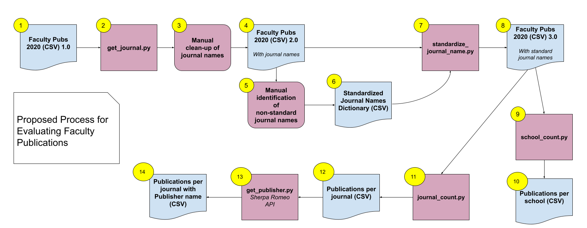

# FACULTY PRODUCTIVITY

A suite of tools to analyze publications by faculty at the twenty-five colleges of the [City University of New York](http://www.cuny.edu/). Created by esilberberg, 2022.

## Overview
The original data set, compiled by the [Office of Research](https://www.cuny.edu/research/office-of-research/), includes citations of scholarly publications by CUNY faculty from 2015-2020. Given that the data set is received as unstructured data, the project passes the data through a series of operations for standardization and analysis. First, the project isolates the journal article name from the full citation. Next, these names are standardized to conform to the accepted journal name. From there, the project tallies the numbers of journals per college and the number of publications by CUNY faculty per journal. Lastly, the project determines the publisher of each journal, utilizing Jisc's [Sherpa Romeo](https://v2.sherpa.ac.uk/romeo/) database.

## Functionality
All scripts are designed to be used as command line tools. To make scripts executable, run the following command: `chmod +x <script.py>`

**Help:** Run the -h flag (--help) after each script to learn about it's positional arguments

### get_journals.py 
Produces the journal name for citations in batch from a list of citations in a CSV file or for a single citation entered into the command line.

Examples:
`$ get_journals.py citations.csv`
`$ get_journals.py 'Doe, J. (2022) New discoveries. Experimental Sciences Quarterly, 3(1). 14-38.'`

Within the CSV file, ensure that citations are listed under the column heading `citation`. This script runs three tests over each citation to extract the journal name: (1) Does the citation conform to APA format? (2) Does the citation comform to MLA format? (3) Is the word `journal` included in the journal title?

The script outputs a CSV file. The default name of this file is `journals-output-%d-%m-%Y-%H-%M-%S.csv` or is customizable by using the -o flag (--output) and entering a string.

Example:
`$ get_journals.py citations.csv -o journal-titles`

## name_standardizer.py
## school_count.py
## journal_count.py
## get_publisher.py

### External Requirements
In order to run `get_publisher.py`, a Sherpa Romeo API key is required. Visit [Sherpa Romeo](https://v2.sherpa.ac.uk/cgi/register) to generate your key. Save this key to a file `SR-api-key.txt` in the same director as the script to run.

## Process Flow Chart

## Credits
[ASCII Text Art Generator](https://fsymbols.com/generators/carty/)

